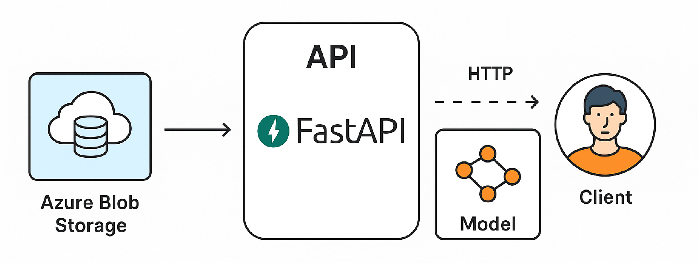

# 👁	Stego-app
**Stego App** is a RESTful service for performing inference using state-of-the-art deep learning models specialized in detecting steganographic noise (hidden information) in grayscale images using state-of-the-art deep learning models.




## Networks Available
Several deep learning models oriented to steganographic noise detection have been proposed, trained and validated using the BossBase 1.01 dataset for `Cover` vs `Stego` image classification.

This inference include CapsNet, Transformer, and KAN architectures. For preprocessing and training details, see the [Capsule-Transformer-KAN in Steganalysis repository](https://github.com/catalina-delgado/Capsule-Transformer-KAN-in-Steganalysis).

Includding inference to R-SIT model. Details of architecture and training, you can found visiting the [R-SIT-Net repository](https://github.com/catalina-delgado/R-SIT-Net).

For access to each model within Hugging Face, refer to [Stego space](https://huggingface.co/spaces/MarilineDelgado/stego)

## Integration guide

### Endpoint
Send POST requests to:

    POST https://apistegoinference.azurewebsites.net/routers/predict-{model}

This endpoint receives a grayscale image (256x256, base64 encoded) as part of a multipart/form-data form, and returns a cover or stego class prediction, its probability, and a Grad-CAM heat map (also in base64).

### Input parameters
- Type request: `multipart/form-data`

- Parameters:

  - `image`: Image file format .png o .jpg

###  Routers
Replace {model} with:

|Model    | Endpoint|
|---------|-------|
| Capsnet | `POST /routers/predict-capsule`   |
| Transformer | `POST /routers/predict-transformer`  |
| KAN | `POST /routers/predict-kan`  | 
| R-SIT | `POST /routers/predict-rsit`  | 

### Response Format
```json
{
"model": "swint",
"layer_name": "layer_12",
"label": "cover",
"probability": 0.94,
"gradcam": "data:image/png;base64,iVBORw0KGgoAAAANS..."
}
```

### JavaScript example
```javascript
const URL = 'https://apistegoinference.azurewebsites.net/routers/predict-rsit';

const formData = new FormData();
formData.append('image', selectedFile);  // donde `selectedFile` es un File del input

fetch(URL, {
    method: 'POST',
    body: formData,
    headers: {
        'Accept': 'application/json'
    },
})
.then(response => response.json())
.then(data => {
    console.log('Prediction:', data.label);
    console.log('probability:', data.probability);
    document.getElementById('output-image').src = data.gradcam;
})
.catch(error => {
    console.error('Request error:', error);
});
```

## [Demo](https://github.com/catalina-delgado/stego_app)

This interface allows users to upload images, receive real-time predictions, and visualize attention heatmaps via Grad-CAM.